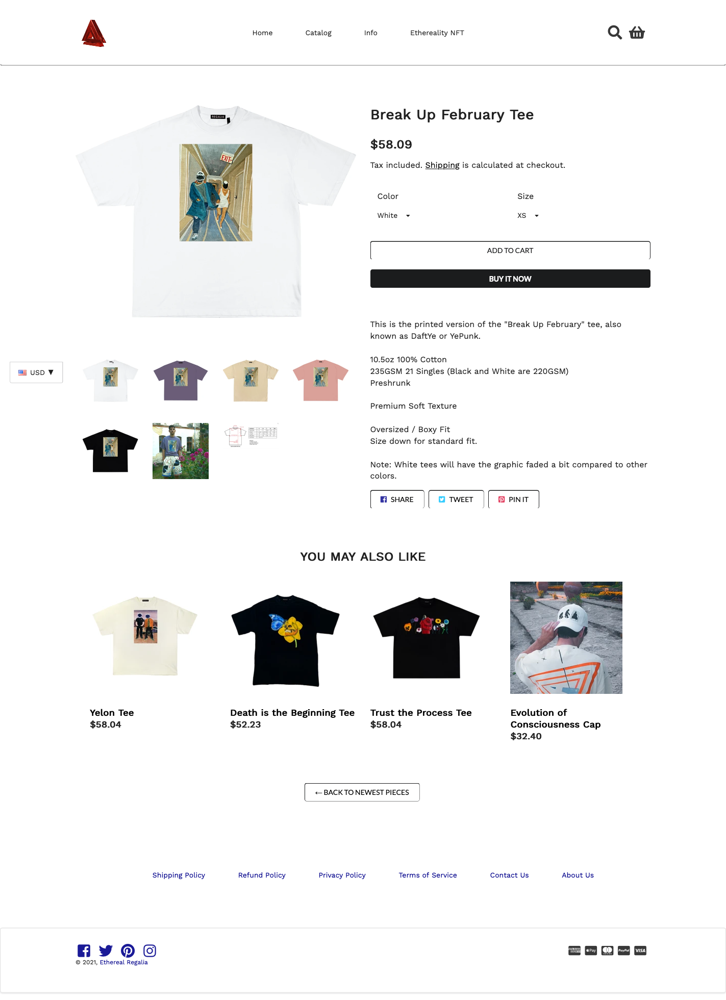

## Patterns for Design

What are design patterns? It's in the name really, design patterns are general solutions to general problems that have been developed for and by software developers through trial and error. The benefit of having design patterns is that they use standard terminology and provide solutions to different scenarios whilst also being the best option due to the long time and hours being poured into making design patterns. There are three main pattern types as defined by the Gang of Four: creational, structural, and behavioral. Diving in specifically to the behavioural pattern types, these largely deal with communication between objects. The iterator pattern is a behavioral pattern that is very commonly used to access elements by traversing containers sequentially without the need for the underlying representation. 

## Graphic Design Patterns are my Passion

It's that time of the year when everyone who uses Spotify checks their Spotify Unwrapped and is presented with tasteful graphics of their music tastes over the last year. As much as I would love to express my personal distaste of 2021's graphic design choices (exemplified in the parody graphic above), this is not the reason I bring this up. The iterator pattern can be seen in media players such as Spotify, where in a playlist there is a list of songs of to choose from and I can select any one of them. By traversing through the playlist, I do not access the underlying representations of each song, i.e. album, artist, genre, but can still play a song of my choice.

## Final Design Pattern

The final nail in the coffin of me never not using a UI framework is the wonderful documentation available for Semantic UI. Since we were on the topic of [buttons](https://semantic-ui.com/elements/button.html), let me just tell you how many different customizable options there are for them. Mind you, most of the time this involves either adding one or two modifier words in the class, and sometimes up to a few lines – but never anything as time consuming and totally eliminates the guesswork required to finagle exact properties. A short and non-exhaustive list of customizable options of buttons are: animations, labels, less or more pronounced, inverted background, color, active versus disabled, social website links, left or right floated, toggles, size all the way up to fluid, grouped vertically and horizontally, etc. The visual layout of the documentation makes it really easy to search for an editable attribute and the source code is only a short embedded click away.

## Kanye, Kim, Daft, and Punk

I leave you with the fruits of four hours of toiling away at my 13-inch MacBook Pro, an embarrassing amount of time involving changing between the various IntelilJ, HTML and Semantic UI documentation Chrome tabs. At the end, I successfully replicated one of my favorite brand’s product webpage, which honestly I would have taken even longer than 240 minutes if I did not use Semantic UI. Of course it is not perfect, but if I knew how to do it perfectly I would not be here.

  
  

Left to right: screenshot of [Ethereal Regalia’s Break Up February Tee](https://etherealregalia.com/collections/frontpage/products/break-up-february-tee-printed-version); screenshot of [E36: Your Choice with Semantic UI](https://github.com/hwangkyh/etherealregalia)

`*` please read this in SpongeBob’s French narrator voice
