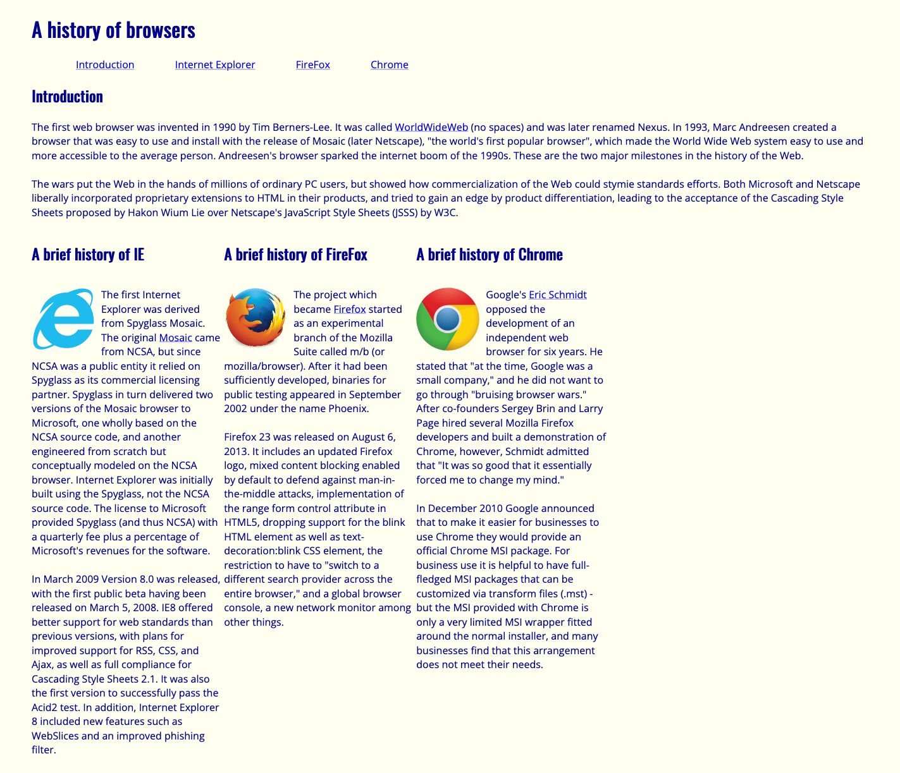
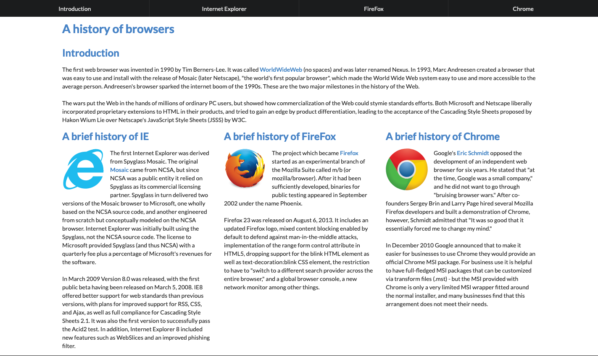
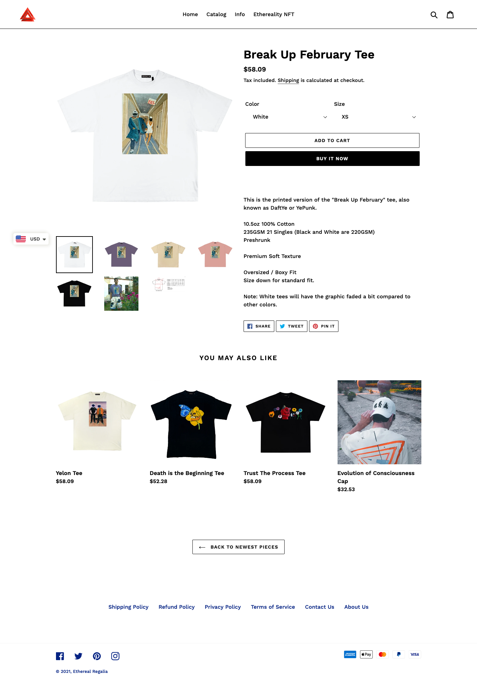
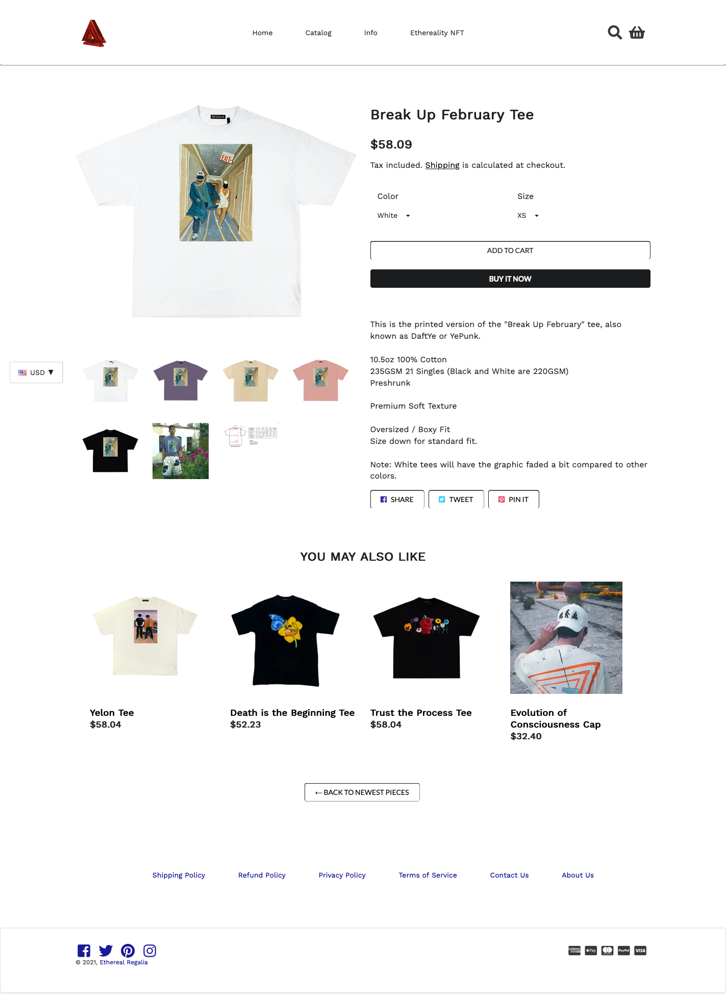

Why use Semantic UI? You could easily find out by asking last week’s me versus today me. The stark difference in frustration, after the initial hurdle of learning Semantic UI, really showed that using a UI framework lends itself to not only cleaner looking websites but also an easier time coding.

## 11 Years Later *

My previous experience with HTML and CSS consists almost exclusively of making and editing Tumblr themes, circa 2010. At the time, I would grab pre-made containers and menus and customize their attributes to fit my page at the time. I have always been a stickler for lined up margins and even padding, so which is why when I encountered the premade containers and different classes available by Semantic UI it gave me massive joy. Semantic UI is a UI framework that helps coders [“create beautiful, responsive layouts using human-friendly HTML”](https://semantic-ui.com/). I really do agree with this statement as when you compare these two screenshots of the same webpage you could easily guess which one was made by using Semantic UI.

<p align="center">
  
  
</p>
Left to right: screenshot of E32: BrowserHistory3; screenshot of E34: BrowserHistory with Semantic UI

## As Easy As Pie

Almost as easy as when Dora asks you to find the map, it is evident which webpage indeed has a beautiful and responsive layout (of course, not the best looking webpage in internet history but relatively). The incredible ease at which it was to learn how to use Semantic UI is in most part due to its very intuitive HTML classes naming, i.e. “ui borderless container topmenu menu” directly lets you know that the div is using Semantic UI, is a borderless container, and is a menu at the top. Creating buttons has also never been so easy, as shown in the example code below, the syntactical ease of noun and modifiers make it very clear on how to variate the different styles of buttons. I even guessed to put in “black” for the “basic button” to turn the text and border from a default dark grey into a black just from intuition.

```
<div class = "ui container">
        <div class="row">
          <button class="fluid ui black basic button">ADD TO CART</button>
        </div>
        <div class="row">
          <button class="fluid ui black button">BUY IT NOW</button>
        </div>
</div>
```

## Read it and Weep

The final nail in the coffin of me never not using a UI framework is the wonderful documentation available for Semantic UI. Since we were on the topic of [buttons](https://semantic-ui.com/elements/button.html), let me just tell you how many different customizable options there are for them. Mind you, most of the time this involves either adding one or two modifier words in the class, and sometimes up to a few lines – but never anything as time consuming and totally eliminates the guesswork required to finagle exact properties. A short and non-exhaustive list of customizable options of buttons are: animations, labels, less or more pronounced, inverted background, color, active versus disabled, social website links, left or right floated, toggles, size all the way up to fluid, grouped vertically and horizontally, etc. The visual layout of the documentation makes it really easy to search for an editable attribute and the source code is only a short embedded click away.

## Kanye, Kim, Daft, and Punk

I leave you with the fruits of four hours of toiling away at my 13-inch MacBook Pro, an embarrassing amount of time involving changing between the various IntelilJ, HTML and Semantic UI documentation Chrome tabs. At the end, I successfully replicated one of my favorite brand’s product webpage, which honestly I would have taken even longer than 240 minutes if I did not use Semantic UI. Of course it is not perfect, but if I knew how to do it perfectly I would not be here.

<div class="ui medium image">
  
  
</div>
  
Left to right: screenshot of [Ethereal Regalia’s Break Up February Tee](https://etherealregalia.com/collections/frontpage/products/break-up-february-tee-printed-version); screenshot of [E36: Your Choice with Semantic UI](https://github.com/hwangkyh/etherealregalia)


`*` please read this in SpongeBob’s French narrator voice
