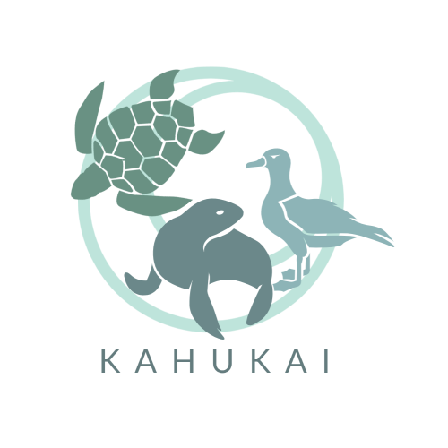

For HACC 2021, our team decided to choose the challenge proposed by NIC Hawaii, the Hawaii Marine Animal Response (HMAR) Sighting & Reporting App. Currently HMAR handles all animal sighting reports by phone. HMAR and NIC mentioned that they would like to have the ability to handle reports via an application as well - to decrease the amount of phone traffic and confusion as well as make it easier to record each sighting.

Our solution for HMAR HACC’s problem is a web browser application that will be accessible on both mobile and computer. We will have different landing pages for the public users who are reporting animal sightings on the go and for the admin users accounts who are the HMAR staff that are managing the sighting reports database. There will be a login page for the admin users to access these additional capabilities. The public users will be shown a landing page with a link to the animal in distress form, animal sighting form, and a more information page. The admin users will have a landing page with a link to submitting a report, or viewing a log of all past submitted reports. When a report is submitted it will be added to the list of records that the admin users view. We are using Meteor etc. to create the application and Mongo will be used to store the animal sightings. Using Meteor will allow the application to be supported on a web browser and mobile devices. The application will be hosted on a Digital Ocean droplet.

For our Bloombugs project we are building off our HMAR HACC solution where we will have each user including the public users register and log in, to have an individual state for each account. It will be individualized through having the public users being able to view their history of past submitted reports. We also will add a function of admins being able to edit all past reports. We will be using the same tech stack as the HMAR HACC and also additional technologies such as ESLint, IDPM, Semantic UI/React. Additionally, the Bloombugs project was further beautified and is optimized for various devices, namely the phone and computer. 

My contributions to this project were mainly in the documentation for the HACC competition as well as on the github.io site of the project. For the application code I mainly focused on the aesthetics via CSS and consistency across the application, optimizing for different devices, and making the past reports editable. What I have learnt from this experience was that Github is an excellent tool for collaboration amongst the team as due to all of our differing schedules it was often difficult to find a time that we could all be online together. Assigning issues to team members through the project boards was also very useful as it showed the various goals that we had to do. It was also very hard to keep up to a rigorous fast paced schedule during the HACC hackathon itself. I had a great time doing this project and was an experience I will never forget. 

More information about the Bloombugs project available at: [bloombugs.github.io](https://bloombugs.github.io/)
Source code for the application available at: [github.com/bloombugs/application](https://github.com/bloombugs/application)
