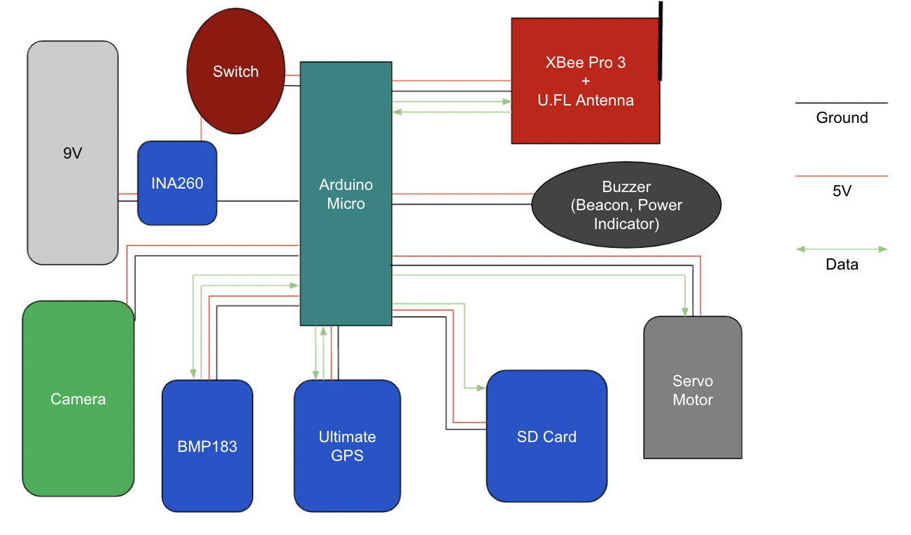

As part of a engineering project at Kapi'olani designed a launchable canister satellite and projectiles according to set objectives for the 2021 CanSat Competition by the American Astronautical Society. For this particular year, the project required the mechananical and electrical teams to collaborate together to create the canister satellite and ejectable autorotating maple seed projectiles. The electrical engineering team, myself and two other computer science students, developed the sensor, communication & data handling, electrical power, flight software, and ground control station subsystems. We also coded Arduinos, MQTT, and Visual Studio for final competition review.

As part of the electrical team, we all collaborated together on the Preliminary Design Review and the Critical Design Review's. I was mainly in charge of the communication & data handling and the electrical power subsystems. For the communication and data handling subsystem I built on my teammate's sensor subsystem and provided key informations about the processors for the containers and the payloads, and the radios and antenna configurations. I also examined the mission guide and presented the telementry and command formats for all packets. For the electrical power subsystem I produced the container and payload's electrical block diagram; the container's electrical block diagram is shown above. This was a high-level schematic showing the power connections betweene all major components, the required voltages, data connections, and external power control and verification. Lastly for this subsystem, a power budget was created for both container and payloads to ensure that the battery on board was enough to power all sensors and components.

The biggest lesson from this project was the importance of working as part of a team. It is easy to set your own goals and work at your own pace if it is a project with only yourself on, but in a group you have to be reliable and organized as to not hinder your fellow groupmates. Technical skills wise I taught myself how to solder and soldered a lot of the electrical components and sensors. I also spent a long time working with the Digi XBee radios, notorious for being difficult to work with. This CanSat experience has been invaluable to me growing as a teammate and improving my technical abilities in both electrical engineering and coding. 

Figure created by [@hwangkyh](https://hwangkyh.github.io/)
