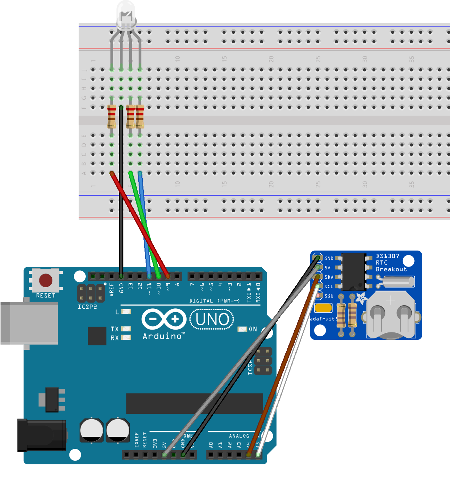

<div class="ui small rounded images">
  
  
  
  
</div>

Traditionally, Hawaiians believe that the rainbow is a pathway between the two worlds of the physical and the spiritual. Spiritually, the origin story of rainbows designate them as sad omens by Kahalaopuna, and also signify the presence of aura of ali’i. Rainbows were also used as communal weather forecasts, such as the kuhonu, the “male” upside-down rainbow, predicting flash floods, and six consecutive east facing rainbows predicting the 1931 Halema’uma’u crater eruption. Rainbows are created by water droplets refracting light, and it is this scientific explanation that gave initial inspiration to this project. Influenced by this Hawaiian culture focus, the personal project that is engineering related and also has a sustainability aspect is an LED panel that outputs various colors following Hawaiian mysticism according to time of day. 

This project was inspired by how mood rings are affected by a temperature variable and translates itself into different visual color. This color idea was expanded to visual representations on a RGB LED depending on the variable of time. Other variables such as the temperature and luminosity sensor were not appropriate due to Hawaii’s relatively temperate climate and potential light interference respectively. From further research into chromotherapy and Hawaiian mysticism, specifically targeting colors at different intervals were chosen depending on the scheduled activity. Each individual color has a unique therapeutic benefit and Hawaiian mystic effect on the human body, mind, and soul. By creating and using this LED code, a daily schedule would eventually become optimized for the user.

Through the SCI295VI program and help from the various professors and mentors involved, I produced Arduino code for initially an LED then an LED panel. All of the present code has been written by me, an example of which is shown below. Through this project, deeper appreciation and understanding of Hawaiian mysticism along with technical knowledge of electrical engineering and coding was gained. Successfully resolving problems as they arose throughout the process also helped in the research experience. Visualizing time in terms of color has been a good alternative to the traditional clock and helped regulate the 2020 summer schedule; the initial goal of optimizing the user’s schedule has been achieved.

Here is some code that shows the LED emitting amber light at 470 ~ 479 minutes (07:50 ~ 07:59) and the LED changing from amber to light green from 480 ~ 484 minutes (08:00 ~ 08:05).

```
} else if ((470 <= timeMinutes) && (timeMinutes <= 479)) { //amber
      Serial.print("amber");
      leds[0].setRGB(255, 191, 0);

  } else if ((480 <= timeMinutes) && (timeMinutes <= 484)) { //amber-lgreen
      Serial.print("amber-lgreen");
      leds[0].setRGB(255, 191, 0);
    for (int n = 0; n < 144; n += 1)
    {
      delay(1667);
      leds[0].b += 1;
      if (leds[0].b > 33) {
        leds[0].r -= 1;
      }
      if (leds[0].b > 97) {
        leds[0].g += 1;
      }
    }
      
  }
```

You can learn more at the [Symposium Website](https://sites.google.com/hawaii.edu/2020peeciisymposium/kapcc/kelly-hwang?authuser=0)

All images and figures created by [@hwangkyh](https://hwangkyh.github.io/)
