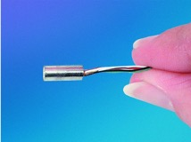
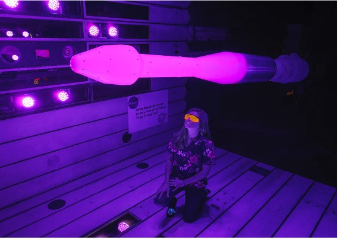

  
  

The current 5-year unsteady pressure sensitive paint (uPSP) development project is looking at developing this wind tunnel pressure measurement technology to reach production capacity. The applications of uPSP is in the launching of vehicles to mitigate vehicles shaking themselves apart due to the sound produced. Another method of measuring pressure is through the kulite microphones and so the cross correlation between uPSP and kulites covering the vehicle model in the wind tunnel will inform the project about the validity of the uPSP data. 

Kulite microphones are placed in strategic locations covering most locations of the vehicle model. uPSP also covers the entire model's surface and both kulite and uPSP data are being recorded. There is so much data that has been produced already from both uPSP and kulites, up to 200GB of raw data produced from 10 second data points. The research is in two parts: the first is looking at the kulite to uPSP comparison from the SLS test using .slow files from run 3014, and the second is looking at the harmonics results from .fast files from run 3091. Scripts using Python were produced to conduct this research and create PSDs by Fourier transform. 

Through this summer internship at ARC, NASA, I have successfully created a Python script that takes in .info and .slow or .fast kulite data and produces PSDs for set kulite sequences of runs 3014 (.slow) and 3091 (.fast) depending on mach number. I also did cross correlation between kulites, showing time lag and decay the further downstream the kulite is. An interesting finding from the PSDs was that for the .fast, there was an aliasing problem at 6kHz and so future implications for the uPSP would need to be examined as the uPSP Nyquist frequency is only 5kHz whilst the kulites were sampled at 200kHz.

[Kulite microphone image source](https://kulite.com//assets/media/2017/06/XCQ-080.jpg); [uPSP vehicle model image source](https://www.nasa.gov/sites/default/files/styles/full_width/public/thumbnails/image/upsp_feature_acd15-0208-004.jpg?itok=DmC3jWJh)

Acknowledgements: thank you to my mentor David Murakami, fellow intern Jack Ortega, the Uncertainty Quantification group, the uPSP project team geoup, and the Universities Space Research Association (USRA). 
